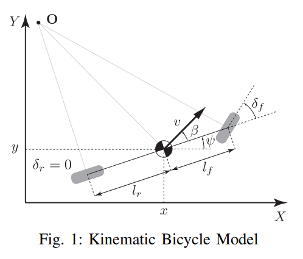

# Self-Driving Car Engineer Nanodegree Program
## MPC - Project 5

<p align="center">
    
</p>

## Basic Build Instructions

1. Clone this repo.
2. Make a build directory: `mkdir build && cd build`
3. Compile: `cmake .. && make`
4. Run it: `./mpc`.

## Project Description

The goal of this project was to implement **` Model Predictive Control`** in `C++` to drive the car around a track in a simulation. Unlike the last project **` PID Control`** the simulator does not provide the **`Cross Track Error`** `(CTE)`, additionally, there's a 100 millisecond latency between actuations commands on top of the connection latency. Our job was choosing the state, inputs, dynamics, constraints and implementing the MPC by modyfying `MPC.cpp`, `MPC.h` and `main.cpp`.

### The Model

The model used for this project is a kinematic one, it is a simplification of a dynamic model and as such it ignores tire forces, gravity, and mass. 

<p align="center">
    
</p>

As shown in the [figure](http://www.me.berkeley.edu/~frborrel/pdfpub/IV_KinematicMPC_jason.pdf) above the kinematic model consists of four states and two actuators:
* **`x`** x position of the car
* **`y`** y position of the car
* **`ψ`** inertial heading 
* **`v`** vehicle speed

* **`δ`** steering actuator
* **`a`** throttle actuator

The update equations for this model are represented by the following code found in `MPC.cpp` (lines 121-133)

```
		  // Recall the equations for the model:
		  // x_[t+1] = x[t] + v[t] * cos(psi[t]) * dt
		  // y_[t+1] = y[t] + v[t] * sin(psi[t]) * dt
		  // psi_[t+1] = psi[t] + v[t] / Lf * delta[t] * dt
		  // v_[t+1] = v[t] + a[t] * dt
		  // cte[t+1] = f(x[t]) - y[t] + v[t] * sin(epsi[t]) * dt
		  // epsi[t+1] = psi[t] - psides[t] + v[t] * delta[t] / Lf * dt
		  fg[1 + x_start + t] = x1 - (x0 + v0 * CppAD::cos(psi0) * dt);
		  fg[1 + y_start + t] = y1 - (y0 + v0 * CppAD::sin(psi0) * dt);
		  fg[1 + psi_start + t] = psi1 - (psi0 + v0 * delta0 / Lf * dt);
		  fg[1 + v_start + t] = v1 - (v0 + a0 * dt);
		  fg[1 + cte_start + t] = cte1 - ((f0 - y0) + (v0 * CppAD::sin(epsi0) * dt));
		  fg[1 + epsi_start + t] = epsi1 - ((psi0 - psides0) + v0 * delta0 / Lf * dt);
```

### Timestep Length and Elapsed Duration (N & dt)

For the timestep length and duration I have chosen the following parameters:
```
size_t N = 10;
double dt = 0.2;
```
These parameters were selected by the method of trial and error. Timestep lenght lower than 10 produced unstable results as there is not enough data to accurately predict the path. Timestep lenght higher than 10 takes too much of the path into consideration and causes the vehicle to steer off the track. The timestep duration was selected based on the latency.

